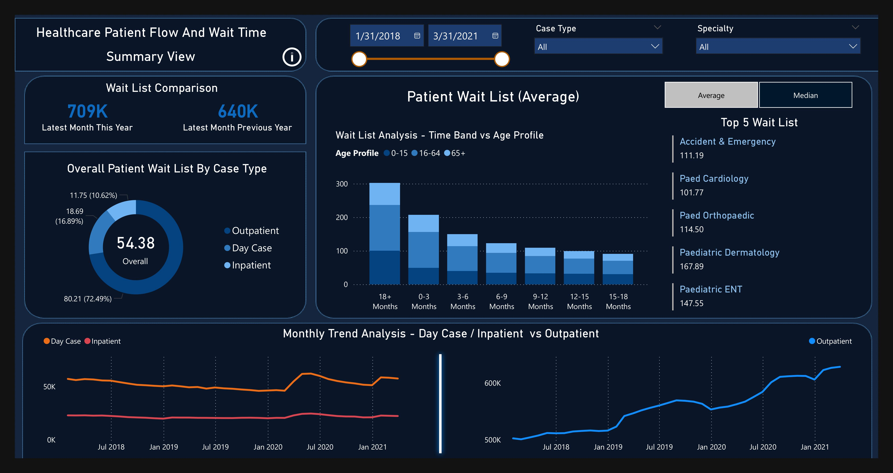
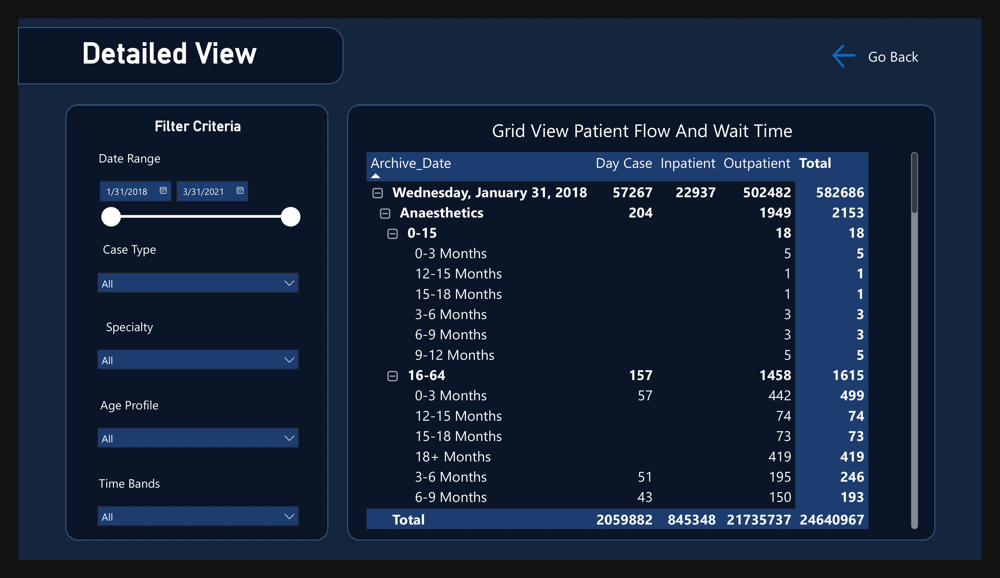

# Healthcare Patient Flow and Wait Time Report

## Table of Contents

- [Overview](#overview)
- [Data Source](#data-source)
    - [Dataset Description](#data-description)
        - [Inpatient Dataset](#inpatient-description)
        - [Outpatient Dataset](#outpatient-description)
        - [Specialty Group](#specialty-group)
- [Key Features](#key-features)
    - [Filters & Slicers](#filters--slicers)
    - [Impactful Visual Components](#impactful-visual-components)
- [Installation](#installation)
- [File Structure](#file-structure)
- [Usage](#usage)
- [Insights](#insights)
- [Technical Details](#technical-details)
- [Recommendations](#recommendations)
- [Future Enhancements](#future-enhancements)
- [Acknowledgements](#acknowledgements)
- [Contributing](#contributing)
- [Contact](#contact)
- [License](#license)


## Overview

The **Healthcare Patient Flow and Wait Time Report** is an analytical dashboard built using Power BI. It provides insights into patient flow dynamics and wait times across various healthcare specialties, case types, and age groups. The dashboard is designed to help healthcare administrators and stakeholders make data-driven decisions by visualizing trends, identifying bottlenecks, and optimizing resource allocation.
Below is a preview of the dashboard: <br><br>





## Data Source

The dataset used in this project is sourced from **pivotalstats.com**. To get data used in this project, click [Dataset](https://pivotalstats.com/end-end-power-bi-dashboard-development/). This dataset contains in patient and outpatient waitlist from 2018 to 2021

### Inpatient Description

| **Column Name**  | **Description**                                                                 |
| ---------------- | ------------------------------------------------------------------------------- |
| `Archive_Date`   | The date when the data was archived or recorded.                                |
| `Specialty_HIPE` | Numerical code representing the medical specialty (e.g., 0, 400, 600).          |
| `Specialty_Name` | Name of the medical specialty (e.g., Small Volume Specialities, Endocrinology). |
| `Case_Type`      | Type of patient case (e.g., Inpatient or Day Case).                             |
| `Adult_Child`    | Age category of the patient (Adult or Child).                                   |
| `Age_Profile`    | Age range group of the patient (e.g., 0-15, 16-64).                             |
| `Time_Bands`     | Duration band since referral or waiting time (e.g., 3-6 Months).                |
| `Total`          | Number of cases corresponding to the row’s conditions.                          |


### Outpatient Description

| Column Name     | Description                                                                 |
| --------------- | --------------------------------------------------------------------------- |
| `Archive_Date`   | Date when the data was recorded or archived                                 |
| `Specialty_HIPE` | Numerical code or ID representing the specialty or health intervention area |
| `Speciality`      | Name of the medical specialty                                               |
| `Adult_Child`    | Indicates whether the record is for adults or children                      |
| `Age_Profile`    | Age group classification                                                    |
| `Time_Bands`     | Time interval related to the case, e.g., waiting time or treatment period   |
| `Total`           | Total count or number of cases/patients corresponding to that record        |


### Specialty Group

| Column Name     | Description                                              |
| --------------- | -------------------------------------------------------- |
| Specialty       | Specific medical specialty or department                 |
| Specialty Group | Broader category or group to which the specialty belongs |


## Key Features

### Filters & Slicers
- **Date Range**: Select a specific date range to filter the data.
- **Specialty**: Filter by specific medical specialties to focus on relevant data.
- **Case Type**: Filter by case type (Inpatient or Outpatient).
- **Age Profile**: Filter by age group (Adult or Child).
- **Time Bands**: Filter by waiting time bands to analyze trends over specific periods.


### Impactful Visual Components
Here are the most useful visuals included in the final dashboard:

1. **Wait List Analysis:** Compares wait list sizes between the latest month of the current year and the previous year, providing insights into changes over time.

2. **Patient Wait List:** Visualizes average wait times across different age profiles and time bands, helping identify high-priority areas.

4. **Monthly Trend Analysis:** Tracks trends in day case, inpatient, and outpatient volumes over time, enabling proactive planning.

5. **Detailed Grid View:** Offers granular data on patient flow and wait times, allowing users to explore specific combinations of filters.


## Installation

1. **Clone the repository:**

    ```bash
    git clone https://github.com/tshihab07/Healthcare-Patient-Analytics.git
    ```


2. **Navigate to the project directory:**

    ```bash
    cd Healthcare-Patient-Analytics
    ```


## File Structure
This repository contains the following files:
```bash
COVID-19-ANALYTICAL-DASHBOARD/
├── AnalyticalDashboard.Report/
│   ├── .pbi/
│   │   │   └── localSettings.json
│   ├── StaticResources/
│   │   │   └── RegisteredResources/
│   │   │   │   └── Slide-DetailPage09996804068298759.PNG
│   │   │   │   └── Slide-SummaryPage8864424903791137.PNG
│   ├── SharedResources/
│   │   │   └── CY24SU08.json
│   │   ├── .platform
│   │   ├── definition.pbir
│   │   ├── report.json
├── AnalyticalDashboard.SemanticModel/
│   │   ├── .pbi/
│   │   │       ├── cache.abf
│   │   │       ├── editorSettings.json
│   │   │       └── localSettings.json
│   │   ├── .platform
│   │   ├── definition.pbism
│   │   ├── diagramLayout.json
│   │   └── model.bim
├── files/
│   │   ├── DashboardReport.pdf
│   │   ├── designLayout_and_ColorPallete.pptx
│   │   ├── inpatient.csv
│   │   ├── outpatient.csv
│   │   └── specialityMap.csv
├── images/
│   │   ├── DetailedView.jpg
│   │   ├── InitialDetailPageDesign.png
│   │   ├── InitialSummaryPageDesign.png
│   │   ├── Slide-DetailPage.PNG
│   │   ├── Slide-SummaryPage.PNG
│   │   ├── Slide-Tooltip.png
│   │   ├── SummaryView.jpg
│   │   └── Tooltip.jpg
├── .gitignore
├── AnalyticalDashboard.pbix
├── AnalyticalDashboard.pbip
├── LICENSE
└── README.md
```


## Usage

1. Install Required Tools
    - Power BI Desktop: Download and install from Microsoft Power BI.
    - Python (Optional): If you want to reproduce the data cleaning steps.

2. Open the Power BI Report
    - Open Power BI Desktop.
    - Navigate to the .pbi directory and open AnalyticalDashboard.Report.
    - Ensure that the data sources are correctly linked.

3. Explore the Dashboard
    - Use the interactive visuals to explore trends and patterns in patient wait flow data across different segments.
    - Apply filters (e.g., date range, case_type) to focus on specific case types or time periods.


## Insights

- **Wait List Trends:** The dashboard highlights changes in wait list sizes over time, indicating periods of increased demand or improved processing efficiency.
- **Specialty-Specific Bottlenecks:** Identifies specialties with the highest wait lists, such as Accident & Emergency, Paediatric Cardiology, and others.
- **Age Profile Analysis:** Reveals how wait times vary across different age groups, helping tailor interventions for vulnerable populations.
- **Case Type Distribution:** Provides insights into the proportion of outpatients, day cases, and inpatients, aiding resource allocation decisions.


## Technical Details

- **Tools Used:**
    - Power BI Desktop
    - Power Query for data transformation
    - DAX for advanced calculations and measures
    - Custom visuals for enhanced interactivity

- **Data Sources:**
    - Hospital patient records database
    - Wait list management system
    - Specialty-specific datasets

- **Dashboard Design:**
    - Responsive layout for desktop and mobile viewing
    - Advanced interactivity features (e.g., "Show 0 or 'No Data' text")
    - Color-coded visuals for easy interpretation


## Recommendations

- **Prioritize High-Wait Specialties:** Allocate additional resources to specialties with the highest wait lists, such as Accident & Emergency and Paediatric Cardiology.
- **Optimize Scheduling:** Implement strategies to reduce wait times for specific age profiles and time bands, especially for critical care areas.
- **Monitor Monthly Trends:** Continuously track monthly trends to anticipate seasonal fluctuations and adjust staffing and capacity accordingly.
- **Enhance Digital Tools:** Leverage digital tools and automation to streamline patient scheduling and reduce administrative delays.


## Future Enhancements

- **Real-Time Data Integration:** Integrate real-time data feeds to provide up-to-date insights.
- **Predictive Analytics:** Incorporate predictive models to forecast future wait times and patient flows.
- **Mobile App:** Develop a mobile-friendly version of the dashboard for on-the-go access.
- **User Roles and Permissions:** Implement role-based access controls for sensitive data.


## Acknowledgements
We would like to express our gratitude to **PivotalStats.com** for providing the comprehensive healthcare data that made this analytical project possible. Their valuable dataset on patient flow and wait times has enabled us to create meaningful insights and actionable recommendations for healthcare administrators.<br>

The data collected from PivotalStats.com serves as the foundation for all visualizations and analyses presented in this dashboard, ensuring accuracy and relevance in our reporting.


## Contributing

Contributions are welcome! If you'd like to contribute:

- Fork the repository.
- Make changes and submit a pull request.
- Ensure that any new features or improvements are well-documented.


## Contact

E-mail: [tushar.shihab13@gmail.com](tushar.shihab13@gmail.com) <br>
More Projects: 👉🏿 [Projects](https://github.com/tshihab07?tab=repositories)<br>
LinkedIn: [Tushar Shihab](https://www.linkedin.com/in/tshihab07/)


## License

This project is licensed under the [MIT License](LICENSE).